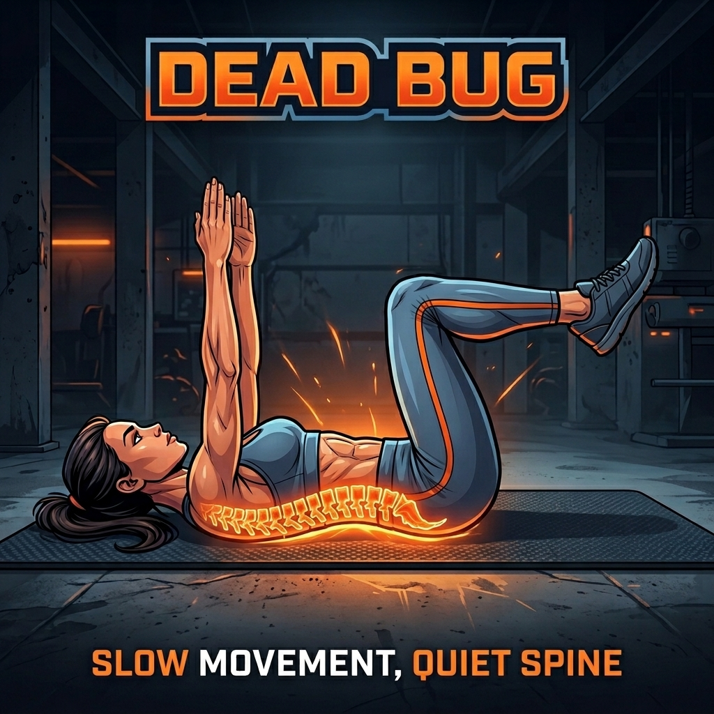

# SpineForge

SpineForge is a phone-first PWA for building a consistent daily back-maintenance habit. Press Start once and the app guides a roughly five-minute stability workout with automatic timers, movement previews, videos, transition cues, streaks, coins, and gentle progression.

<p align="center">
  
</p>

## Daily Routine

1. Hip hinge wall taps
2. Bird dog
3. Side plank - 30 seconds per side
4. Dead bug
5. Glute bridge

The workout advances automatically. Transition screens show the next movement, active intervals loop its demonstration video, and sound/vibration cues mark starts, switches, and finishes.

## Movements

| Movement | Exercise card | Demo |
| --- | --- | --- |
| Hip hinge wall taps |  | [Video](public/video/hip-hinge-wall-taps-video.mp4) |
| Bird dog |  | [Video](public/video/bird-dog-video.mp4) |
| Side plank |  | [Video](public/video/side-plank_video.mp4) |
| Dead bug |  | [Video](public/video/Dead-bug-video.mp4) |
| Glute bridge |  | [Video](public/video/glute-bridge-video.mp4) |

## Progress And Rewards

- Completing the daily workout maintains the streak and earns coins.
- Each completed day lets the user add one second to a chosen exercise.
- Every extra second completed earns one additional coin.
- Coins unlock cosmetic themes, sounds, titles, badges, and rewards.

All progress is stored locally in the browser. SpineForge currently has no accounts or cloud sync, so clearing site data resets progress.

## Run Locally

```bash
npm install
npm run dev
```

Production check:

```bash
npm run build
npm run lint
```

## Deployment

The `main` branch is connected to Vercel. Pushing to GitHub triggers a Vite build with `npm run build` and deploys the generated `dist` directory.
